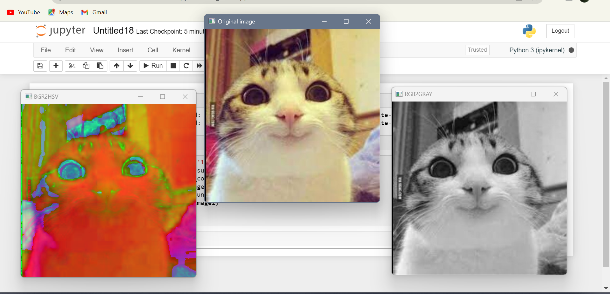
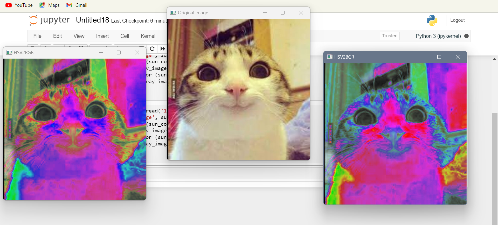
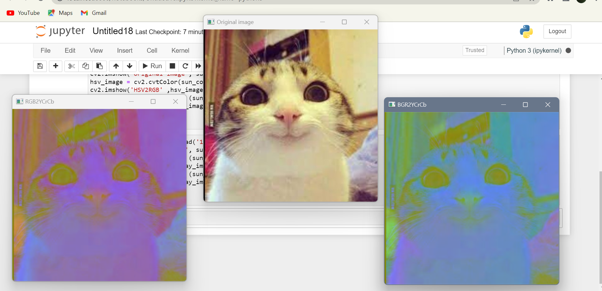
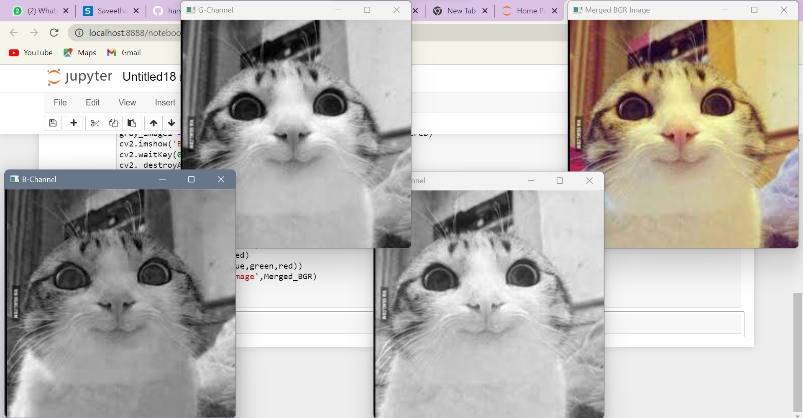
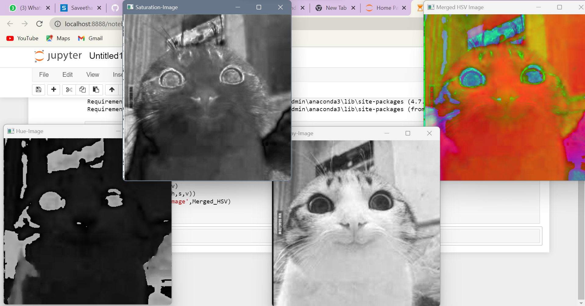

# Color Conversion
## AIM
To perform the color conversion between RGB, BGR, HSV, and YCbCr color models.

## Software Required:
Anaconda - Python 3.7
## Algorithm:
### Step1:
Import cv2 and save and image as filename.jpg

### Step2:
Use imread(filename, flags) to read the file.

### Step3:
Use cv2.cvtColor(src, code, dst, dstCn) to convert an image from one color space to another.

### Step4:
Split and merge the image using cv2.split and cv2.merge commands.

### Step5:
End the program and close the output image windows.

## Program:
```
Developed By: LATHIKA SUNDER
Register Number: 212221230054
```

```python
# i) Convert BGR and RGB to HSV and GRAY
import cv2
sun_color_image = cv2.imread('image.jpg')
cv2.imshow('Original image', sun_color_image)
hsv_image = cv2.cvtColor(sun_color_image, cv2.COLOR_BGR2HSV)
cv2.imshow('BGR2HSV' ,hsv_image )
gray_image1 = cv2.cvtColor (sun_color_image, cv2.COLOR_RGB2GRAY)
cv2.imshow('RGB2GRAY', gray_image1)
cv2.waitKey(0)
cv2. destroyAllWindows()


# ii)Convert HSV to RGB and BGR
import cv2
sun_color_image = cv2.imread('image.jpg')
cv2.imshow('Original image', sun_color_image)
hsv_image = cv2.cvtColor(sun_color_image, cv2.COLOR_HSV2RGB)
cv2.imshow('HSV2RGB' ,hsv_image )
gray_image1 = cv2.cvtColor (sun_color_image, cv2.COLOR_HSV2BGR)
cv2.imshow('HSV2BGR', gray_image1)
cv2.waitKey(0)
cv2. destroyAllWindows()


# iii)Convert RGB and BGR to YCrCb
import cv2
sun_color_image = cv2.imread('image.jpg')
cv2.imshow('Original image', sun_color_image)
gray_image1 = cv2.cvtColor (sun_color_image, cv2.COLOR_RGB2YCrCb)
cv2.imshow('RGB2YCrCb', gray_image1)
gray_image1 = cv2.cvtColor (sun_color_image, cv2.COLOR_BGR2YCrCb)
cv2.imshow('BGR2YCrCb', gray_image1)
cv2.waitKey(0)
cv2. destroyAllWindows()


# iv)Split and Merge RGB Image
import cv2
image = cv2.imread('image.jpg')
blue=image[:,:,0]
green=image[:,:,1]
red=image[:,:,2]
cv2.imshow('B-Channel',blue)
cv2.imshow('G-Channel',green)
cv2.imshow('R-Channel',red)
Merged_BGR=cv2.merge((blue,green,red))
cv2.imshow('Merged BGR Image',Merged_BGR)
cv2.waitKey(0)
cv2.destoryAllWindows()


# v) Split and merge HSV Image
import cv2
image = cv2.imread('image.jpg')
hsv = cv2.cvtColor(image, cv2.COLOR_BGR2HSV)
h,s,v = cv2.split(hsv)
cv2.imshow('Hue-Image',h)
cv2.imshow('Saturation-Image',s)
cv2.imshow('Gray-Image',v)
Merged_HSV = cv2.merge((h,s,v))
cv2.imshow('Merged HSV Image',Merged_HSV)
cv2.waitKey(0)
cv2.destoryAllWindows()

```
## Output:
### i) BGR and RGB to HSV and GRAY


### ii) HSV to RGB and BGR


### iii) RGB and BGR to YCrCb


### iv) Split and merge RGB Image


### v) Split and merge HSV Image
 

## Result:
Thus the color conversion was performed between RGB, HSV and YCbCr color models
